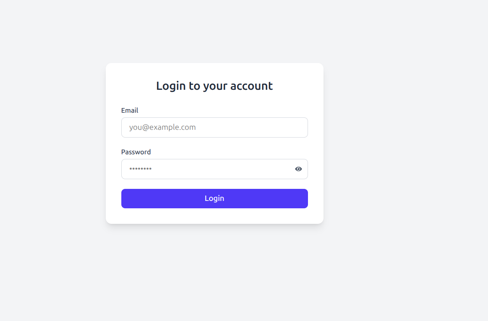
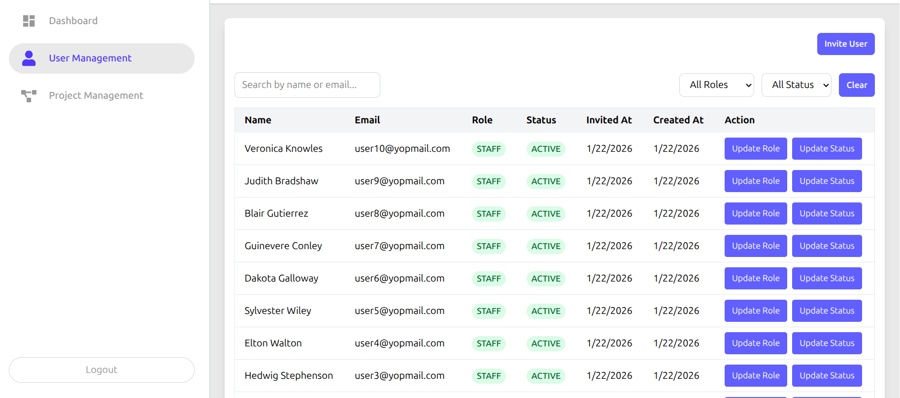
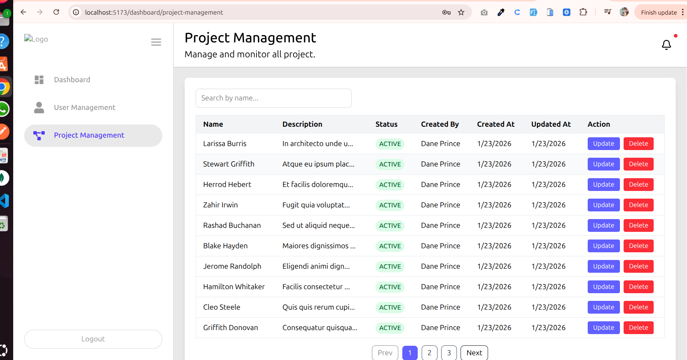
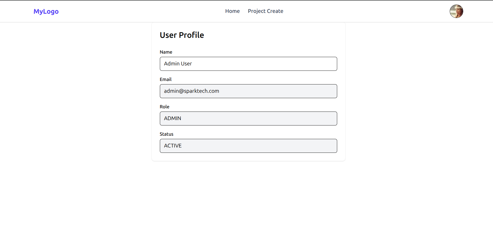

# Role-Based Project Management System

A modern, full-featured project management application with role-based access control built using React, TypeScript, and Vite. This system enables organizations to manage projects efficiently with distinct user roles (Admin and User) and comprehensive project tracking capabilities.

## 🚀 Features

### Authentication & Authorization
- **Secure Login System** - JWT-based authentication with token management
- **Invite-Based Registration** - Users can only register through admin invitations
- **Role-Based Access Control** - Two distinct roles with different permissions:
  - **Admin**: Full system access including user and project management
  - **User**: Access to personal projects and profile management

### Admin Dashboard
- **User Management** - Invite users, manage roles, and update user status
- **Project Management** - Oversee all projects across the organization
- **User Table** - View and manage all registered users with filtering and sorting
- **Project Table** - Comprehensive project overview with management capabilities

### User Features
- **Project Creation** - Create and manage personal projects
- **Project Viewing** - Browse all available projects
- **Profile Management** - Update personal information and preferences
- **Protected Routes** - Secure access to authorized features only

### UI/UX
- **Responsive Design** - Fully responsive interface built with TailwindCSS
- **Modern Components** - Clean, professional UI with loading states and skeletons
- **Toast Notifications** - Real-time feedback using React Hot Toast
- **Sweet Alerts** - Beautiful confirmation dialogs with SweetAlert2
- **Icon Library** - Rich icon set from Lucide React and React Icons

## 🛠️ Tech Stack

### Core Framework
- **React 19** - Latest React with improved performance and features
- **TypeScript** - Type-safe development experience
- **Vite 7** - Lightning-fast build tool and dev server

### State Management
- **Redux Toolkit** - Simplified Redux with modern best practices
- **RTK Query** - Powerful data fetching and caching solution

### Routing
- **React Router v7** - Client-side routing with protected routes

### Styling
- **TailwindCSS v4** - Utility-first CSS framework
- **@tailwindcss/vite** - Official Vite plugin for Tailwind

### UI Components & Libraries
- **React Hook Form** - Performant form validation and handling
- **React Hot Toast** - Lightweight toast notifications
- **SweetAlert2** - Beautiful, responsive popup boxes
- **Lucide React** - Modern icon library
- **React Icons** - Popular icon sets
- **React Loader Spinner** - Loading indicators

### Development Tools
- **ESLint** - Code linting and quality enforcement
- **TypeScript ESLint** - TypeScript-specific linting rules
- **Vite Plugin React** - Fast Refresh and optimizations

## 📁 Project Structure

```
RoleBaseProjectFrontend/
├── public/                 # Static assets
├── src/
│   ├── api/               # API integration layer
│   │   ├── admin/         # Admin-specific API calls
│   │   ├── auth/          # Authentication APIs
│   │   ├── base-api/      # RTK Query base configuration
│   │   └── project/       # Project-related APIs
│   ├── assets/            # Images, fonts, and other assets
│   ├── authentication/    # Login and registration pages
│   ├── components/        # Reusable UI components
│   │   ├── AdminNavbar.tsx
│   │   ├── Navbar.tsx
│   │   ├── ProfileSkeleton.tsx
│   │   ├── ProjectCard.tsx
│   │   ├── ProjectSkeleton.tsx
│   │   └── Spinner.tsx
│   ├── main-layout/       # Layout components
│   ├── pages/             # Page components
│   │   ├── project/       # Admin project management
│   │   ├── user/          # User-specific pages
│   │   │   ├── profile/   # User profile
│   │   │   └── project/   # User project pages
│   │   └── user-management/ # Admin user management
│   ├── route/             # Routing configuration
│   │   ├── AdminProtectRoute.tsx
│   │   ├── ProtectedRoute.tsx
│   │   └── route.tsx
│   ├── store/             # Redux store configuration
│   ├── utility/           # Helper functions and types
│   ├── App.tsx            # Root component
│   ├── main.tsx           # Application entry point
│   └── index.css          # Global styles
├── .env                   # Environment variables (not in git)
├── .env.example           # Environment variables template
├── .gitignore             # Git ignore rules
├── eslint.config.js       # ESLint configuration
├── index.html             # HTML entry point
├── package.json           # Dependencies and scripts
├── tsconfig.json          # TypeScript configuration
├── tsconfig.app.json      # App-specific TypeScript config
├── tsconfig.node.json     # Node-specific TypeScript config
├── vite.config.ts         # Vite configuration
└── vercel.json            # Vercel deployment config
```

## 🚦 Getting Started

### Prerequisites

- **Node.js** (v18 or higher recommended)
- **npm** or **yarn** package manager

### Installation

1. **Clone the repository**
   ```bash
   git clone https://github.com/MD-Ishan-Rana-MIR/RoleBaseProjectFrontend
   cd RoleBaseProjectFrontend
   ```

2. **Install dependencies**
   ```bash
   npm install
   ```

3. **Set up environment variables**
   
   Create a `.env` file in the root directory by copying the example:
   ```bash
   cp .env.example .env
   ```
   
   Then update the `.env` file with your actual values:
   ```env
   VITE_BASE_URL=http://localhost:5500/api/v1
   ```

4. **Start the development server**
   ```bash
   npm run dev
   ```
   
   The application will be available at `https://role-base-project-frontend.vercel.app/` (or another port if 5173 is in use).

## 🔧 Environment Variables

This project requires the following environment variables:

| Variable | Description | Example |
|----------|-------------|---------|
| `VITE_BASE_URL` | Backend API base URL | `https://admin-project-management-system-bac.vercel.app/api/v1` |

> **Note**: All Vite environment variables must be prefixed with `VITE_` to be exposed to the client-side code.

See [`.env.example`](.env.example) for a complete template.

## 📜 Available Scripts

| Command | Description |
|---------|-------------|
| `npm run dev` | Start development server with hot reload |
| `npm run build` | Build for production (TypeScript compilation + Vite build) |
| `npm run preview` | Preview production build locally |
| `npm run lint` | Run ESLint to check code quality |

### Development Workflow

```bash
# Start development
npm run dev

# Build for production
npm run build

# Preview production build
npm run preview

# Check code quality
npm run lint
```

## 🎨 Screenshots

_Screenshots will be added here to showcase the application interface._

### Login Page


### Admin Dashboard


### User Project Management


### User Profile


## 🏗️ Architecture Highlights

### API Layer
- **RTK Query** for efficient data fetching and caching
- Automatic request deduplication
- Optimistic updates for better UX
- Tag-based cache invalidation

### Authentication Flow
- JWT tokens stored in localStorage
- Automatic token injection in API requests
- Protected routes with role-based guards
- Invite-based registration system

### Routing Strategy
- Public routes: Login, Invite Registration
- User-protected routes: Project creation, Profile
- Admin-protected routes: User Management, Project Management
- Nested layouts for dashboard and web views

## 🤝 Contributing

Contributions are welcome! Please follow these steps:

1. Fork the repository
2. Create a feature branch (`git checkout -b feature/AmazingFeature`)
3. Commit your changes (`git commit -m 'Add some AmazingFeature'`)
4. Push to the branch (`git push origin feature/AmazingFeature`)
5. Open a Pull Request

## 📄 License

This project is licensed under the MIT License - see the LICENSE file for details.

## 👨‍💻 Author

**Your Name**
- GitHub: [@yourusername](https://github.com/yourusername)
- Email: your.email@example.com

## 🙏 Acknowledgments

- Built with [Vite](https://vitejs.dev/)
- UI powered by [TailwindCSS](https://tailwindcss.com/)
- State management by [Redux Toolkit](https://redux-toolkit.js.org/)
- Icons from [Lucide](https://lucide.dev/) and [React Icons](https://react-icons.github.io/react-icons/)

---

**Note**: This is a frontend application that requires a backend API to function. Ensure your backend server is running and the `VITE_BASE_URL` environment variable is correctly configured.